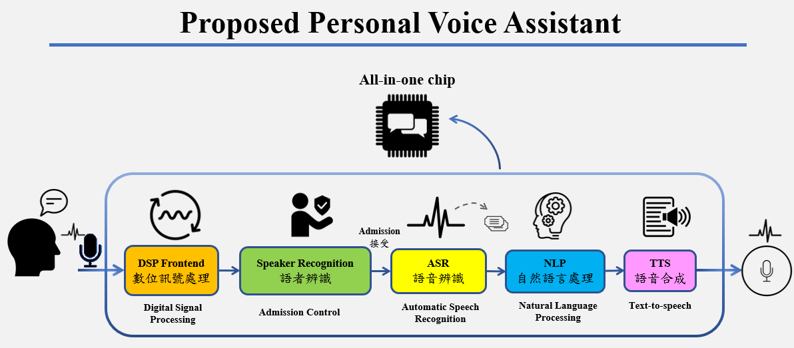

# 數位語音助理系統之實作與實現

* Title : Implementation-and-Realization-of-A-Digital-Voice-Assistant-System
* Author : Chien-Hung Lin

## 摘要 (Abstract)
隨著語音應用的快速發展，人工智慧語音助理於各種應用場景中扮演著至關重要的角色。不僅被廣泛運用於智慧家居控制，更能讓用戶透過語音指令輕鬆掌控家居設備，還延伸至行車助手、語音搜索和問答、會議安排、醫療輔助、教育、客戶服務等多個領域。本論文的目標在於實作邊緣運算之人工智慧語音助理系統，包含五個主要模組：數位語音處理、語者身分識別、語音辨識、自然語意理解/文本生成，以及語音合成輸出。
數位語音處理模組位於系統前端，其目的是對輸入語音進行增強處理。語者辨識模組賦予語音助理系統識別註冊語者聲音的能力，僅對註冊語者提供服務，避免冒充者和欺騙攻擊。語音辨識模組將使用者的聲音資訊轉換為文字。自然語言處理模組基於文字序列實現對語義的理解，透過自然語言生成技術提供適當的回應與行動。最後的語音合成模組使語音助理能夠將文字轉換為自然、有效的語音互動形式。
首先，於本論文中將對每項模組進行獨立最佳化訓練。隨後，將這五項經過訓練的模組按序整合成一個端對端的模型。於整合過程中，目標是在邊緣運算的情境下，系統在效能和複雜度之間取得平衡，以達到最佳效果。將系統效能指標定義為自然言語文本生成的準確性，而系統複雜度包含模型大小、運算時間等因素。

## 環境 (Requirements)
* Ubuntu 24.01 LTS
* Python 3.10

## (程式)資歷夾中具以下兩種資料夾 ：
- 數位訊號處理(speech_enhancement)  :  通過數位訊號處理提高語音訊號的清晰度和質量，確保語音資料的準確性和可用性。
- 語者辨識(speaker_recognition)  : (語者註冊、語者辨識),開發能夠準確辨識不同語者的技術，以提高系統的安全性和個性化服務能力。
- 語音辨識(automatic_speech_recogni)  : (聲音轉文字),利用深度學習技術訓練語音辨識模型，並不斷優化模型參數以提高辨識精度。
- 自然語言處理(text_generation, LLM)  : (文字生成並回復),結合語音與文本的多樣形態進行學習，提升系統的綜合理解能力。
- 語音合成(text_to_speech)  : (文字轉聲音),研發高品質的語音合成技術，使語音助理能夠生成自然流暢的語音回應。
  

## (ros_robotarm_objdetect)資歷夾中具以下檔案 ：
### 1. 程式 ：
- **Multi-execute.sh**                        ：  啟動下列程式碼，此程式中具備兩種模式，(1)test為確認相機視角是否正確，(2)voice為本專題的主體使用模式，因此使用者須自行編輯程式碼來添加、去除註解字元(#)。
- **pose_action_client_finger_cartesian.py**  ：  驅動協作型機器手臂程式。
- **voice_detect.py**                         ：  偵測語音程式。
- **voice_object_detect.py**                  ：  座標轉換程式(語音辨識版本)。
- **camera_tf_broadcaster.py**                ：  定義相對座標程式。
- **object_detect.py**                        ：  座標轉換程式(點擊螢幕版本)。

### 2. 音檔 ：
- **ball.mp3**  ：  尋問使用者是否要進行夾取物件(球)。
- **bottle.mp3**：  尋問使用者是否要進行夾取物件(寶特瓶)。
- **cup.mp3**   ：  尋問使用者是否要進行夾取物件(杯子)。
- **no.mp3**    ：  回應取消物件夾取的語音。
- **yes.mp3**   ：  回應協作型機器手臂將要開始夾取的語音。
- **ok.mp3**    ：  回應[好的]。
  
## 操作流程：
1. 開啟兩個terminal，分別進入launch及ros_robotarm_objdetect資料夾，輸入以下指令：roslaunch Arm_camera_start.launch 及 source Multi-execute.sh。

2. 語音輸入的語音具備**七項功能**：球、杯子、瓶子、放開、抓住、放回去、離開。

3. 當使用者說出要夾取的物件名稱後，系統會再次詢問此物件，需再次回應語音：是、不是。

## 引文(Citation)：
Please cite the following if you make use of the code.

>@inproceedings{kye2020meta,
  title={Implementation-and-Realization-of-A-Digital-Voice-Assistant-System},
  author={Chien-Hung Lin},
  year={2024}
}
