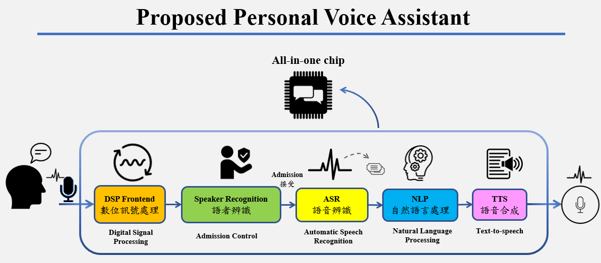
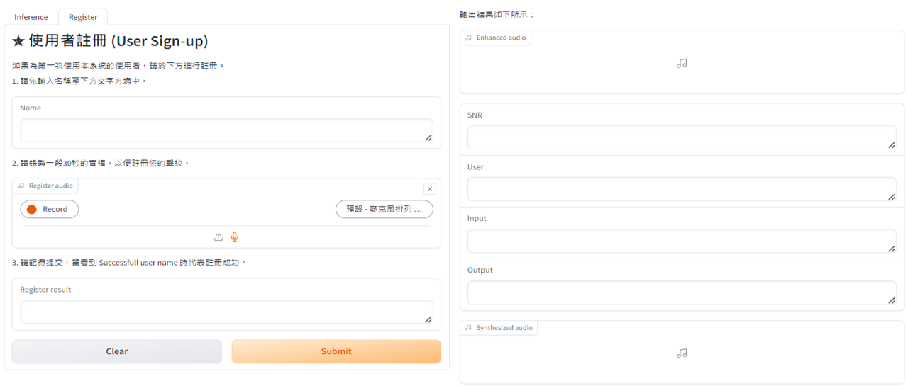
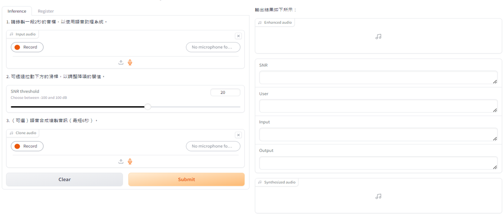

# 數位語音助理系統之實作與實現

* Title : Implementation-and-Realization-of-A-Digital-Voice-Assistant-System
* Author : Chien-Hung Lin

## 簡介 (Introduction) :
本專案旨在採用最新的深度學習技術來實作一套人工智慧語音助理，結合大規模語音數據集進行訓練，以提高系統的適應性和普遍化能力。專案將針對以下幾個方面進行開發（如圖所示）：數位訊號處理，通過先進的數位訊號處理技術提高語音訊號的清晰度和質量，確保語音資料的準確性和可用性；語者辨識，開發能夠準確辨識不同語者的技術，以提高系統的安全性和個性化服務能力；語音辨識，利用深度學習技術訓練語音辨識模型，並不斷優化模型參數以提高辨識精度；自然語言處理，結合語音與文本的多樣形態進行學習，提升系統的綜合理解能力，讓語音助理能夠更加準確地理解和回應使用者的需求；語音合成，研發高品質的語音合成技術，使語音助理能夠生成自然流暢的語音回應，增強人機互動的自然性。此外，本論文計畫將語音助理整合至嵌入式系統，使其能應用於更多的設備及環境中，通過嵌入至更小且高效的硬體平台上，以實現語音技術於智慧家居、醫療輔助、教育、汽車電子等多個領域的更廣泛應用。

## 環境 (Requirements) :
* Ubuntu 24.01 LTS
* Docker
* Python 3.10

## 功能 (Feature)：
- **數位訊號處理(Speech_Enhancement)**   ： 基於 Facebook Demucs 實現噪音去除，透過添加 SNR 機制，判斷回傳值為何。[code : speech_enhancement]
- **語者辨識(Speaker_Recognition)** ： 基於 Meta-learning 使用 Resnet、Resnest 進行模型上的訓練，區分出不同說話者(註冊語者、非註冊語者、欺騙攻擊)。<code : speaker_recognition>
- **語音辨識(Automatic_Speech_Recogni)** ： 基於 OpenAI Whisper 實現，透過使用更多語料(Aishell-2、Aishell-3)來去進行微調，實現聲音轉文字。<code : automatic_speech_recogni>
- **自然語言處理(Text_generation, LLM)** ： 基於 Meta Llama 2，透過設定合適的 Prompt 實現文本生成。<code : text_generation>
- **語音合成(Text_To_Speech)** ： 基於 XTTS，透過使用更多語料(Common_voice)來去進行微調，實現自然語音的輸出。<code : text_to_speech>
  
## 程式 (code) ：
- **main.py**                ：
- **configure.py**           ：
- **final_v1.py**            ：  
- **feature_extraction.py**  ：  
- **cert.pem**               ：  
- **key.pem**                ：  
  
## 操作流程：

## 實作結果：

--**註冊介面(Register)** ：

--**實用介面(Inference)** ：

## 引文(Citation)：
Please cite the following if you make use of the code.

>@inproceedings{kye2024meta,
  title={Implementation-and-Realization-of-A-Digital-Voice-Assistant-System},
  author={Chien-Hung Lin},
  year={2024}
}
